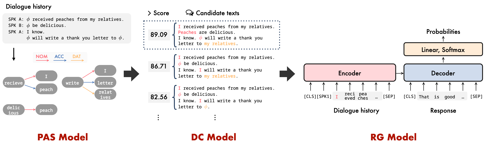

# Dialogue Response Generation Using Completion of Omitted Predicate Arguments Based on Zero Anaphora Resolution
[](https://github.com/ayk24/dczar/blob/main/pyproject.toml)
[](https://www.python.org/downloads/)
[](https://github.com/psf/black)
[](https://github.com/ayk24/dczar/blob/main/LICENSE)


This repository provides the source code of following paper:
- Title: Dialogue Response Generation Using Completion of Omitted Predicate Arguments Based on Zero Anaphora Resolution.
- Conference: the 24th Meeting of the Special Interest Group on Discourse and Dialogue (SIGDIAL2023), Main Conference (Oral)

## Overview
- DCZAR is a framework that explicitly completes omitted information in the dialogue history and generates responses from the completed dialogue history.
- The DCZAR framework consists of three models: a predicate-argument structure analysis (PAS) model, a dialogue completion (DC) model, and a response generation (RG) model.
  - The PAS model analyzes the omitted arguments (zero pronouns) in the dialogue, and the DC model determines which arguments to complete and where to complete them and explicitly completes the omissions in the dialogue history.
  - The RG model, trained by the complementary dialogue history and response pairs, generates a response.
  - The PAS and RG models are constructed by fine-tuning the common pretrained model with a dataset corresponding to each task, while the DC model uses a pretrained model without fine-tuning.



## Requirements
- python 3.9
- poetry 1.6.0 or higher
- [docker](https://www.docker.com/) 20.10.15 or higher
- docker-compose 2.6.0 or higher

## Setup
### Installing Dependencies
```sh
$ cd dczar
$ poetry install
$ git clone https://github.com/NVIDIA/apex
$ cd apex
$ pip install -v --disable-pip-version-check \
  --no-cache-dir --global-option="--cpp_ext" \
  --global-option="--cuda_ext" ./
```

### Installing Dependencies with Docker
Before building, place the files necessary to run MeCab and Cabocha in `docker/lib`.
- Build
    ```sh
    $ cd dczar
    $ docker-compose -f docker/docker-compose.yml up -d --build
    ```
- Enter the docker container (Interactive)
    ```sh
    $ docker exec -it dczar sh
    $ poetry install
    ```

## Usage
1. [Preprocessing the corpus](docs/preprocess.md)
2. [Preraining](docs/pretraining.md)
3. [Fine-tuning & evaluating PAS model](docs/pas_model.md)
4. [Running DC model](docs/dc_model.md)
5. [Fine-tuning & evaluating RG model](docs/rg_model.md)

## Citation
```bib
@inproceedings{ueyama-etal-2023-dialogue,
    author    = {Ayaka Ueyama and Yoshinobu Kano},
    title     = {Dialogue Response Generation Using Completion of Omitted Predicate Arguments Based on Zero Anaphora Resolution},
    booktitle = {In Proceedings of the 24th Meeting of the Special Interest Group on Discourse and Dialogue (SIGDIAL2023)},
    year      = {2023}
}
```

## Acknowledgment
This repository is built upon the following works:
- Pseudo Zero Pronoun Resolution Improves Zero Anaphora Resolution. [[PDF]](https://aclanthology.org/2021.emnlp-main.308.pdf) [[code]](https://github.com/Ryuto10/pzero-improves-zar)
